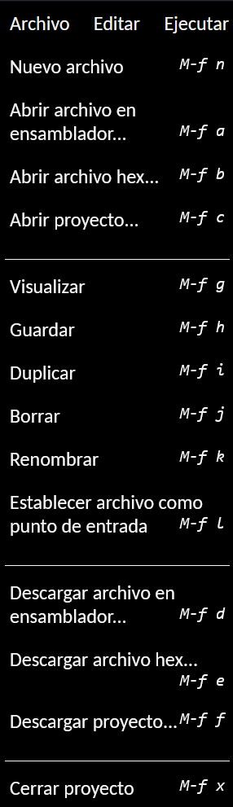
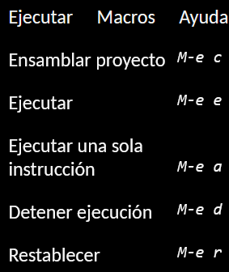
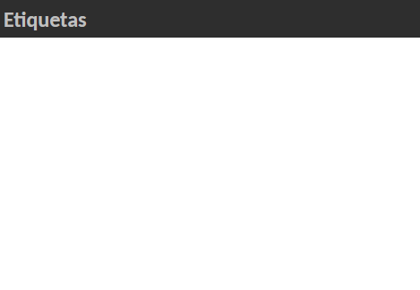

= Emulator Z80: User Manual
twilight1794 rapunzel@disroot.org Emi rapunzel@disroot.org
:doctype: book
:toc:
:library: Asciidoctor

[abstract]
The Web Assembler Emulator is a web-based tool that allows you to run and debug programs written in assembly language in a virtual environment. This manual provides detailed instructions on how to use the emulator and its features.

[[purpose]]
.Objective

This document provides information focused on system description for those responsible for developing, implementing, and using it in {library}.

TIP: It is more intuitive to try the examples shown on your own.

== Introduction
The emulator for the Z80 microprocessor is very useful for understanding how a microprocessor works, how each line or instruction (mnemonics) can affect the registers, stack, memory, and how, with the combination of these, you can assemble a program in assembly language. It also allows you to disassemble the mnemonics that are loaded to obtain the object code.
This is done with a user interface where you can load files or enter them manually, with the ability to temporarily save the files that have been used.

=== System Requirements

The Web Assembler Emulator runs on a compatible web browser. Make sure you have the following requirements:

    Modern web browser (Google Chrome, Mozilla Firefox, Safari, etc.)
    Stable Internet connection

== Installation

??

=== Basic Usage

Below are the basic steps to use the Web Assembler Emulator:

    Open your web browser and access the Web Assembler Emulator webpage.
    In the emulator interface, you will find an assembly source code editor and a results display section.
    Write or paste your assembly source code into the editor.
    Configure emulation options, such as the load address from where the program will start loading and the memory size available during execution.
    Click the "Run" button to start the program execution.
    Use the available debugging options, such as "Step by Step" or "Pause", to track the program step by step and analyze the state of registers and memory at each step.
    View the results depending on your program.
    End the execution when the program has finished or reached a breakpoint.

=== Commands and Options

The Web Z80 Emulator provides an intuitive, click-based interface to perform the following actions:

[[defs]]
Run::
Option in the top-left toolbar

    New file: Add a new working file.
    Load assembly/hexadecimal file: Allows you to load an assembly source code file from your local device to the emulator.
    Open project: Allows you to open a set of assembly files.
    Save file: Saves the changes made to the file.
    Display: ............................
    Duplicate: Duplicates one of the loaded files.
    Delete: Removes a file from the page.
    Rename: Changes the name of the file.
    Set file as entry point:
    .........................
    Download assembly file: Allows you to save your assembly source code to your local device.
    Download hexadecimal file: Allows you to save the assembly hexadecimal code to your local device.
    Download project: Downloads the set of designated files as a project to your local device.

Edit::
Text editor manipulation

    Cut: Copies and removes the selected text element.
    Copy: Saves the selected text element.
    Paste: Inserts the saved text element.
    Find and Replace: Finds matches with the required text element and, if needed, replaces it.
    Insert label: ...........................
    Insert directive: .........................
    Insert mnemonic: .......................

Run::
Execution tools for the file.

    Assemble project: Reads the file and assembles it.
    Run: Starts the execution of the file until a breakpoint is reached.
    Execute single instruction: Executes the assembled file one instruction at a time.
    Stop execution: Stops the execution when the user indicates.
    Reset: Resets the program to the initial address without arguments.

<<Execution>>

Help::

    Tools to support users in understanding the emulator.

    User Manual: Provides user assistance without technical concepts to facilitate the use of the emulator.
    Report a Problem: Helps developers report any issues.
    Repository: Direct URL to the GitHub repository.
    Check for Updates: Notifies the latest version.
    About: General information about the emulator.

<<Manual>>
<<Searches>>

=== Activity Bar

Explorer::
[[Explorer]]

The main function of the explorer is to view all the files that are opened or created to execute code.

Find and Replace::
[[Searches]]

The goal is to enter a string that you want to search for, which can be an instruction or any text element, and find matches throughout the file. Additionally, you can enter a string to replace and facilitate the search and replace process. You can search for a string, escape characters, or a regular expression.

Execution::
[[Execution]]
image::docs/Ejecución.png[]

It displays the instruction pointer that the assembler is currently moving to, the size being used, the current instruction being executed, the next instruction to be executed, the cycles being taken, and other information to obtain useful insights into the execution.

Message Console::
[[Console]]

It shows important messages regarding the execution, such as if a label was not found, if the operand or referenced register is invalid, and other relevant information.

Labels::
[[Labels]]

It displays the labels that the execution recognized. These labels do not necessarily have to be declared, so to know which labels were registered, the execution must be performed first.

Macros::
[[Macros]]

This section lists all the macros detected during execution, allowing us to keep track of which ones were correctly identified and not mistaken for labels.

Manual::
[[Manual]]

Provides direct documentation of the manual to understand how the emulator was developed and how to use it.

=== Workspace
[[Memory]]

The memory section allows us to view the actual state of the file being used in a hexadecimal format. It can assign values needed for the program to allocate necessary memory or perform read operations. The ASCII representation is shown on the left side. The memory in this case grows.

[[Help]]
image::docs/Ayuda.png[]

The help section provides the necessary information for users to understand what is happening in the program, whether an error occurred or the program was successfully assembled.

[[Stack]]

A stack is a data structure used to store temporary information in an organized manner. It operates on the principle of "last in, first out" (LIFO), meaning that the last element placed in the stack is the first one to be removed.

The stack is implemented using a memory section called the "stack." In assembly language, there are specific instructions for stack operations, such as pushing and popping elements.

The main function of a stack in assembly language is to provide a mechanism for temporarily storing registers, function return values, and local variables.

[[Registers]]
image::docs/Registros.png[]

Registers are internal storage locations within the CPU used for temporarily storing data, memory addresses, operation results, and other purposes. Registers have a fixed size and are directly accessible by processor instructions, allowing fast and efficient data access.

Registers may vary depending on the processor architecture. However, there are some common registers found in many processor architectures. In this case, they are represented with hexadecimal values, and there are flag registers that indicate specific conditions based on the executed function.

== About this Document
v1.0, 2023-05-20
