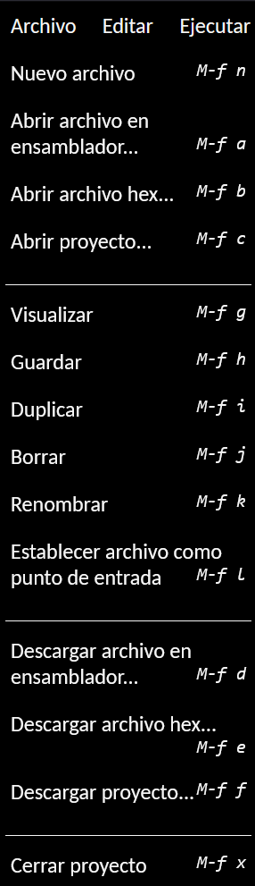
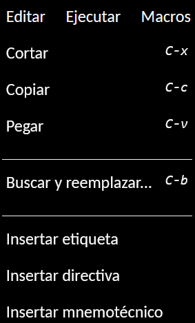
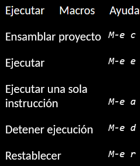
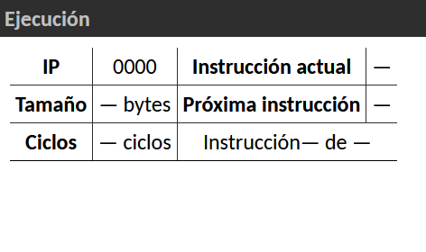
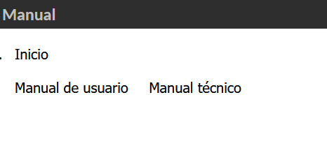
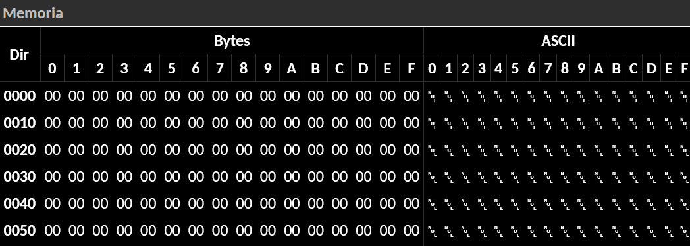
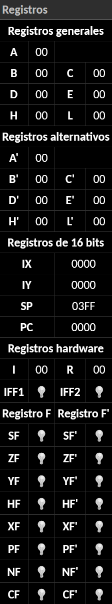

= Emulador Z80: Manual de usuario
twilight1794 <rapunzel@disroot.org> Emi <emilio.cruz.vargas123@gmail.com> 
:doctype: book
:toc: 
:library: Asciidoctor

[abstract]
El Emulador de Ensamblador en Web es una herramienta basada en la web que permite ejecutar y depurar programas escritos en lenguaje ensamblador en un entorno virtual. Este manual proporciona instrucciones detalladas sobre cómo utilizar el emulador y sus características.

[[purpose]]
.Objetivo
****
Este documento da la información enfocada en la descripción del sistema para los encargados de desarrollarlo, implementarlo y utilizarlo en {library}.
****
TIP: Es más intuitivo probar los ejemplos que se muestran por cuenta misma.

== Introducción
El emulador para el microprocesador Z80 nos es de mucha utilidad para entener como funciona un mircroprocesaor, como cada línea o instrucción (mnemónicos) pueden afectar a los registros, la pila, la memoria y así con el conjunto de estos lograr ensamblar un programa en lenguaje ensamblador, asimismo poder desensamblar los mnemónicos que se carguen para obtener el código objeto.
Esto con una interfaz de usuario dónde puede hacer una carga de archivos o poder ingresarlos manualmentecon la posibilidad de guardar temporalmente los archivos que se hayan estado utilizando. 

=== Requisitos del sistema

El Emulador de Ensamblador en Web se ejecuta en un navegador web compatible. Asegúrese de tener los siguientes requisitos:

    Navegador web moderno (Google Chrome, Mozilla Firefox, Safari, etc.)
    Conexión a Internet estable

== Instalación

??

=== Uso básico

A continuación se describen los pasos básicos para utilizar el Emulador de Ensamblador en Web:

    Abra su navegador web y acceda a la página web del Emulador de Ensamblador.
    En la interfaz del emulador, encontrará un editor de código fuente ensamblador y una sección de visualización de resultados.
    Escriba o pegue su código fuente ensamblador en el editor.
    Configure las opciones de emulación, como la dirección de carga de dónde se empezará a cargar el programa, el tamaño de emmoria que estará disponible durante la ejecución.
    Haga clic en el botón "Ejecución" para iniciar la ejeucición dle programa.
    Utilice las opciones de depuración disponibles, como "Paso a paso" o "Pausa", para realizar un seguimiento paso a paso del programa y analizar el estado de los registros y la memoria en cada paso.
    Visualice los resultados dependiendo de su programa.
    Finalice la ejecución cuando el programa haya terminado o haya alcanzado un punto de interrupción.

=== Comandos y opciones

El Emulador Z80 en Web proporciona una interfaz intuitiva y basada en clics para realizar las siguientes acciones:

[[defs]]
Ejecutar::
    Opción en la barra de herramientas superior izquierda

    Nuevo archivo: Agregar un neuvo fichero de trabajo
    Cargar archivo en ensamblador/hexadecimal: Permite cargar un archivo de código fuente ensamblador desde su dispositivo local al emulador.
    Abrir proyecto: Permite abrir un conjunto de archivos en ensamblador.
    Guardar archivo: Guarda los cambios que se le hicieron al archivo
    Visualizar: ............................ 
    Duplicar: Duplica alguno de los archivos que se tengan cargados
    Borrar: Elimina un archivo de la página
    Renombrar: Cambia el nombre del archivo
    Establecer archivo como punto de entrada:
    .........................
    Descargar archivo en ensamblador: Le permite guardar su código fuente ensamblador en su dispositivo local.
    Descargar archivo en hexadecimal: Le permite guardar el código hexadecimal ensamblador en su dispositivo local.
    Descargar proyecto: Descarga el conjunto de archivos que se designaron archivos en su dispositivo local.

Editar::
    Manipulación del editor de texto

    Cortar: Copia y elimina el elemento de texto seleccionado
    Copiar: Guarda el elemento de texto seleccionado
    Pegar: Coloca el elemento de texto guardado
    Buscar y reemplazar: Encuentra coincidencias con el elemento de texto requerido y en caso de requerirlo, sustituirlo
    Insertar etiqueta: ...........................
    Insertar directiva: .........................
    Insertar mnemotécnico: .......................

Ejecutar::
    Herramientas de ejecución para el archivo.

    Ensamblar proyecto: Hace la lectura del archivo y ensambla este.
    Ejecutar: Empieza la ejecución del archivo hasta alcanzar un punto de interrupción.
    Ejecutar una sola instrucción: Con el archivo ensamblado hace una ejecución por instrucción.
    Detener ejecución: En caso de que se haga ejecución completa lo detiene cuando el usuario lo indique.
    Restablecer: Vuelve a poner como dirección inicial al programa sin argumentos

<<Ejecución>>

Ayuda::
    Herramientas para el apoyo al usuario para el entendimiento del emulador.

image::BarraAyuda.png[]

    Manual de usuario: Ayuda al usuario sin conceptos técnicos para facilitar el usuo del emulador.
    Informar sobre un problema: Ayuda a los desarrolladores a informar sobre algún problema
    Repositorio: URL directa para el repositorio de GitHub
    Buscar actualizaciones: Notifica la versión más reciente 
    Acerda de: Información general del emulador.

<<Manual>>
<<Busquedas>>

=== Barra de actividades

Explorador::
[[Explorador]]
image::Explorado.png[]
La principal función del explorador es poder ver todos los archivos que se abren o se creen para ejecutar código.

Buscar y reemplazar::
[[Busquedas]]
image::Busqueda.png[]
El objetivo es ingresar una cadena que se quiera buscar, puede ser uns instrucción o cualquier elemento de texto y hacer una busqueda de coincidencias por el archivo, a su vez también se puede colocar una cadena por la cuál se pueda reemplazar y facilitar el trabajo de busqueda y reemplazo, se puede buscar tanto una cadena, como caracteres de escape o una expresión regular.

Ejecución::
[[Ejecución]]

Se encarga de mostrar el apuntador de instrucción en el cuál se está moviendo el ensamblador, el tamaño que se está utilizando, a partir del apuntador de instrucción nos dice que instrucción es la que se está ejecutando actualmente, la siugiente instrucción que se ejecutara, los ciclos que está teniendo, entre otros apra obtener información útil de que es lo que está pasando en la ejecución.

Consola de mensajes::
[[Consola]]
image::Consola.png[]
Nos muestra los mensajes importantes que la ejecución estuvo teniendo, en estos puede ir si no se encontró una etiqueta, si el operando o el registro al que se hizo referencia es invalido o entre otros.

Etiquetas::
[[Etiquetas]]

Nos muestra las etiquetas que la ejecución se dió cuenta que tenía, estás no necesariamente tienenn que estar declaradas o no, por lo que para saber que etiquetas se registraron se tiene que hacer primero la ejecución.

Macros::
[[Macros]]

Es el apartado de todas las macros que se detectaron al hacer la ejecución, nos permite tener un control de cuáles se identificaron correctamente y no se identificaron como una etiqueta.

Manual::
[[Manual]]

Nos proporciona la documentación directa del manual para saber tanto cómo fue desarrollado el emulador y cómo utilizarlo.

=== Espacio de trabajo
[[Memoria]]

La sección de memoria nos permite poder ver en estado real con un formato hexadecimal como es que se guardó el archivo que estamos utilizando, en está se le pueden asignar los valores que se necesiten para que el mismo programa haga la recolección de memoria necesaria o la lectura, también se muestra en el lado izqquierdo en formato ASCII. La memoria en esté caso va creciendo.

[[Ayuda]]

La sección de ayuda permite que el usuario esté teniendo la información necesaria de lo que está pasando en el programa, si tuvo un error o se ensamblo el programa con éxito.

[[Pila]]

Una pila es una estructura de datos que se utiliza para almacenar información temporal de manera organizada. Su funcionamiento se basa en el principio de "último en entrar, primero en salir" (LIFO, por sus siglas en inglés), lo que significa que el último elemento que se coloca en la pila es el primero en ser retirado.

La pila se implementa utilizando una sección de memoria denominada "pila" o "stack". En ensamblador, hay instrucciones específicas para realizar operaciones en la pila, como empujar (push) y sacar (pop) elementos.

La función principal de una pila en ensamblador es proporcionar un mecanismo para almacenar temporalmente registros, valores de retorno de funciones y variables locales.

[[Registros]]

Los registros son ubicaciones de almacenamiento internas de la CPU que se utilizan para almacenar datos temporales, direcciones de memoria, resultados de operaciones y otros fines. Los registros son de tamaño fijo y están directamente accesibles por las instrucciones del procesador, lo que permite un acceso rápido y eficiente a los datos.

Los registros pueden variar dependiendo de la arquitectura del procesador. Sin embargo, hay algunos registros comunes que se encuentran en muchas arquitecturas de procesadores. En este caso se representan con valores hexadecimales y hay reigstros de banderas que prenderan una luz en caso de ser activados dependiendo de la función que se esté ejecutando.

== Sobre este documento
v1.0, 2023-05-20
